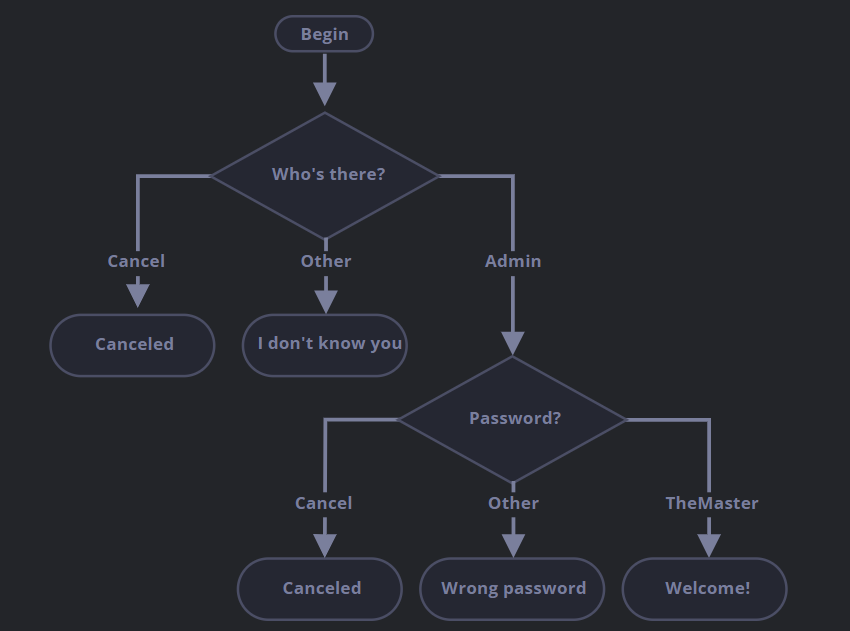

### [登录校验](https://zh.javascript.info/logical-operators#deng-lu-xiao-yan)

重要程度: 3

实现使用 `prompt` 进行登录校验的代码。

如果访问者输入 `"Admin"`，那么使用 `prompt` 引导获取密码，如果输入的用户名为空或者按下了 Esc 键 —— 显示 “Canceled”，如果是其他字符串 —— 显示 “I don’t know you”。

密码的校验规则如下：

- 如果输入的是 “TheMaster”，显示 “Welcome!”，
- 其他字符串 —— 显示 “Wrong password”，
- 空字符串或取消了输入，显示 “Canceled.”。

流程图：

请使用嵌套的 `if` 块。注意代码整体的可读性。

提示：将空字符串输入，prompt 会获取到一个空字符串 `''`。Prompt 运行过程中，按下 ESC 键会得到 `null`。