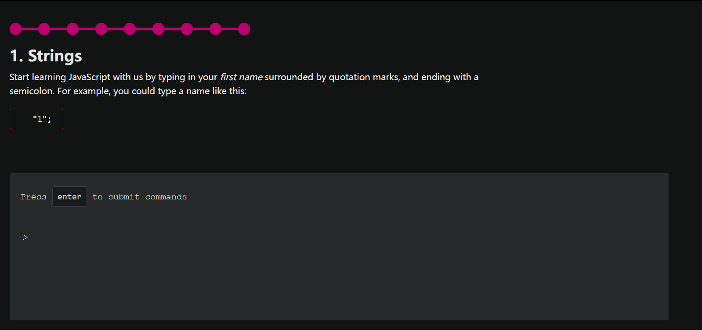

# 教程

https://github.com/Asabeneh/30-Days-Of-JavaScript

https://developer.mozilla.org/zh-CN/docs/Web/JavaScript

## [严格相等 `===`](https://developer.mozilla.org/zh-CN/docs/Web/JavaScript/Equality_comparisons_and_sameness#严格相等)

全等操作符比较两个值是否相等，两个被比较的值在比较前都不进行隐式转换。如果两个被比较的值具有不同的类型，这两个值是不全等的。否则，如果两个被比较的值类型相同，值也相同，并且都不是 number 类型时，两个值全等。最后，如果两个值都是 number 类型，当两个都不是 NaN，并且数值相同，或是两个值分别为 +0 和 -0 时，两个值被认为是全等的。

```javascript
var num = 0;
var obj = new String("0");
var str = "0";
var b = false;

console.log(num === num); // true
console.log(obj === obj); // true
console.log(str === str); // true

console.log(num === obj); // false
console.log(num === str); // false
console.log(obj === str); // false
console.log(null === undefined); // false
console.log(obj === null); // false
console.log(obj === undefined); // false
```

在日常中使用全等操作符几乎总是正确的选择。对于除了数值之外的值，全等操作符使用明确的语义进行比较：一个值只与自身全等。对于数值，全等操作符使用略加修改的语义来处理两个特殊情况：第一个情况是，浮点数 0 是不分正负的。区分 +0 和 -0 在解决一些特定的数学问题时是必要的，但是大部分情况下我们并不用关心。全等操作符认为这两个值是全等的。第二个情况是，浮点数包含了 NaN 值，用来表示某些定义不明确的数学问题的解，例如：正无穷加负无穷。全等操作符认为 NaN 与其他任何值都不全等，包括它自己。（等式 `(x !== x)` 成立的唯一情况是 x 的值为 NaN）


# 开发

类似于 https://www.javascript.com/ `try JavaScript` 的教、练一体？

